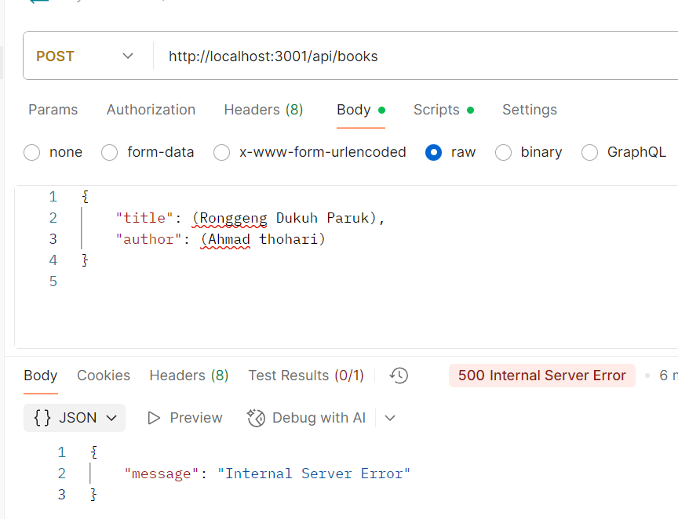
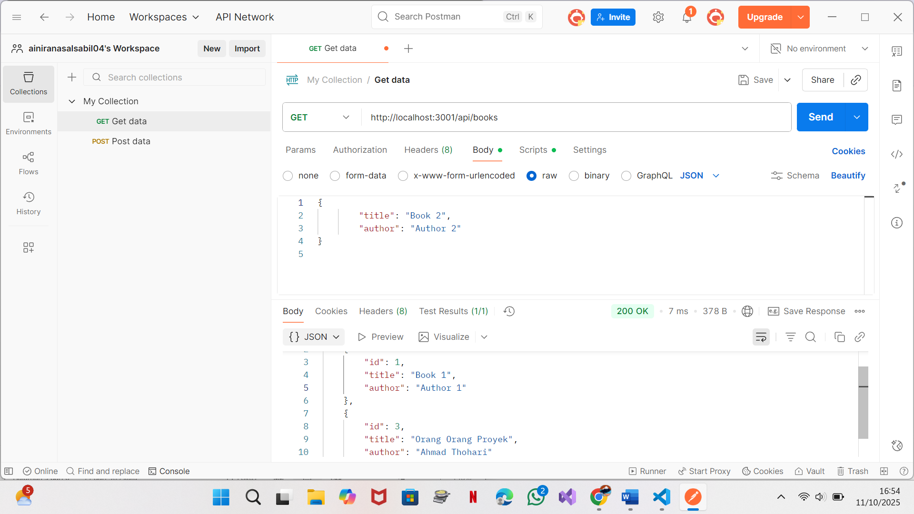
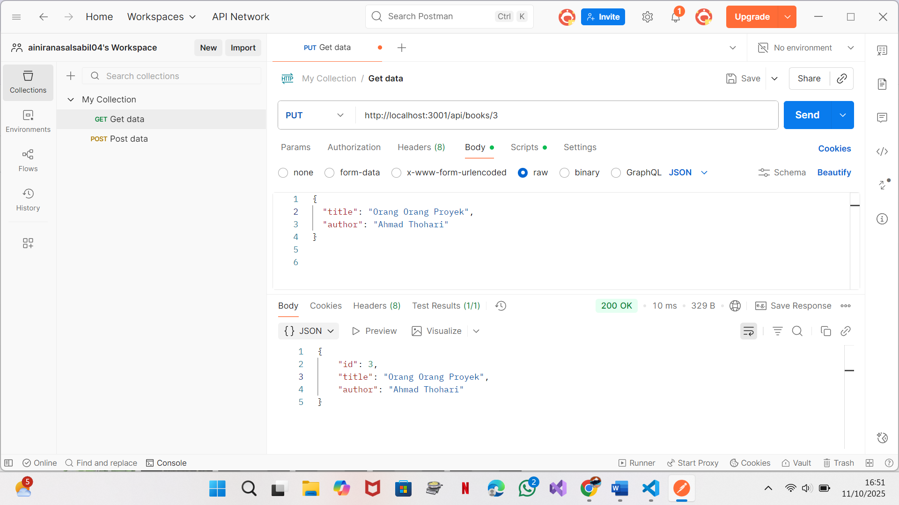
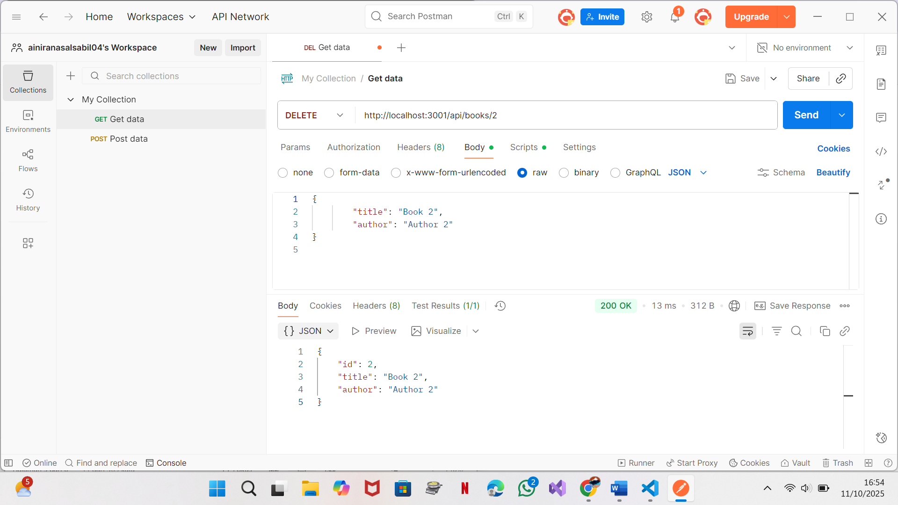

# CRUD Aplikasi

### 1. Create (Tambah Data)
Menampilkan form untuk menambahkan data baru ke dalam sistem.

### 2. Read (Lihat Data)
Menampilkan daftar data yang sudah tersimpan di dalam database.

### 3. Update (Ubah Data)
Memungkinkan pengguna mengubah data yang sudah ada.

### 4. Delete (Hapus Data)
Fitur untuk menghapus data yang tidak dibutuhkan lagi.

